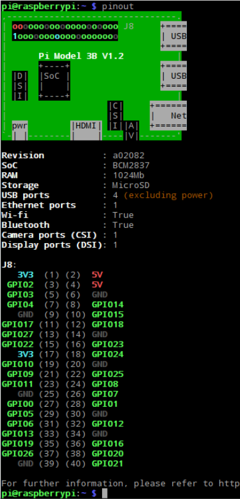

# Pi notes  

### Setting up a Raspberry Pi 3 as an Access Point  

  #### Introduction

You shouldnt need to do this. I have configured my rpi to run headless even without an access point. The requirements to do this is a hotspot from your phone. Your phone can serve as a remote access point when you need to access on the fly.  

Otherwise, if your rpi is like stuck in a location forever and you dont need to change the files just do this. JESSICA is doing this. Tho seems kinda pointless to me tho cause it removes the internet access.  

https://learn.sparkfun.com/tutorials/setting-up-a-raspberry-pi-3-as-an-access-point/all  
```sudo apt-get -y install hostapd dnsmasq```  

> Note1: If you are connected to your Raspberry Pi using SSH over wireless, you will want to connect with a keyboard/mouse/monitor, Ethernet, or serial instead until we get the access point configured.  

> Note2: This causes your RPI to boot SLOW!

> Note3: If you accidentally remove your ssh to your headless pi then ethernet to your computer and angry ip scanner it to find the ip adresss. not recommended but its a fix to your problem


___________________
### SSH
```sudo apt install openssh-server```  
THEN  
```sudo raspi-config``` OR

```
sudo systemctl enable ssh
sudo systemctl start ssh
```
to get ip address of rpi  
```ip a```  
to ssh in  
```ssh pi@pi_ip_address```  
login as needed
____________________________
### Raspi-config  
```sudo raspi-config```  

This gives you several options to tinker with. They are namely, but not limited to :

 - set sound to come out of hdmi/jack
 - ssh
 - i2c
 - spi

 ### Config joystick
 http://wiki.ros.org/joy/Tutorials/ConfiguringALinuxJoystick


### MFRC522

```raspi-config``` and turn on SPI  
```pip3 install mfrc522``` to install mfrc522 package #or pip  
make sure idle is installed.
```lsmod | grep spi``` to see whether spi is running or not

#### Example Code

```
#a project by https://pypi.org/project/mfrc522/
from time import sleep
import sys
from mfrc522 import SimpleMFRC522
reader = SimpleMFRC522()

try:
    while True:
        print("Hold a tag near the reader")
        id, text = reader.read()
        print("ID: %s\nText: %s" % (id,text))
        sleep(5)
except KeyboardInterrupt:
    GPIO.cleanup()
    raise
```
_____________________________


### Listing USB devices

`ls -l /dev | grep ttyUSB`

________________________


### Common errors  

Problem : cannot connect to security.ubuntu to receive updates. Usually occurs when doing through proxy.  
Solution : The issue is that the proxy settings are not being passed to the "sudo" level. You are able to ping and wget stuff as a normal user since you have the `http_proxy` and `https_proxy` settings set for that current user. When you use sudo, those environment variables are not passed to the elevated user.  

The solution is to use -E with sudo to pass on those environment variables to the elevated user.  
`sudo -E apt-get update`  

  do everything with `sudo -E`

____________________________

### RPI GPIO

https://learn.sparkfun.com/tutorials/raspberry-gpio/python-rpigpio-api

put this at the top of your python file

```
import RPi.GPIO as GPIO
GPIO.setmode(GPIO.BCM) #use conventional io numbering system
```

### declaring pins

```
GPIO.setup(18, GPIO.OUT)
```

### digital output

```
GPIO.output(18, GPIO.HIGH)
```

high sets pin to 3.3v, low sets it to 0v


### pwm analog

only one pin is capable of this madness. this is pin18. pwm takes a value in from 0-100.

`GPIO.PWM(<pin>, <frequency>)`


```
pwm = GPIO.PWM(18, 1000)
# sets pwm up with frequency of 1khz on pin 18
pwm.start(50)
# outputs 50% duty cycle
```

to change duty cycle mid code, 

```
pwm.ChangeDutyCycle(75)
```


to stop pwm,

```
pwm.stop()
```


### Pull up/ Pull down Resistors

RPI has an inbuilt pud resistor. usually used for buttons or inputs in general

```
GPIO.setup(17, GPIO.IN, pull_up_down=GPIO.PUD_UP)
```

```
GPIO.setup(17, GPIO.IN, pull_up_down=GPIO.PUD_DOWN)
```


### PINOUT

RPI allows you to see its pinout conventions with a command in terminal. This is made available by `GPIO Zero` library.

```
pinout
```

<p align="center">
  
</p>


# Linux Notes


### Basic Shell Commands

`cd ..` moves up one directory

`cd ~` moves to home directory

`cd /` cd into root


`ls /` lists all the directories from root (the lowest file point in the system)

`cp <file> <target directory copied to>` copies files

`pwd` print working directory. Gets you the file path.


`cat` displays in terminal the contents of a .py or .txt file. For example, `cat pose_estimator.py`

`history` shows you the bash history - a list of commands executed previously


### `mv` Move

moves directory to directory. cut and paste.

`sudo mv <file path> <target file path>`

for eg.

`sudo mv ~/bbb_ws/data/cetran /data/`


beware : this can also be used to **RENAME** files.

`mv <file1.ext> <file2.ext>`


### `rm` Remove

remove target file. Does not remove directories (Folders)

`rm *<pattern>` for example

`rm *.txt` removes all files with `.txt` extension.


### `rm -R` Remove recursively

Removes target directory and all its contents. Be careful with this command.
`rm -R <path to directory to be removed>`


### `rmdir` Remove Directory

deletes empty directories, useful for deleting directory only if it is empty.
Navigate to target dir, then `rmdir <name of directory>`


### `cp` Copy

**cp directory to directory**

to copy both the contents as well as the file directory to the target, do :

`cp -R <dir> <target dir>`

to copy only the contents and not the directory, do :

`cp -RT <dir> <target dir>`


### `scp` Secure Copy

**Introduction**

while `cp` is for copying local files, `scp` is for remote file transfer, and mostly used by me to copy files when on ssh. This is useful for many reasons; If my linux is connected to my rpi, and I want to transfer files between the 2, I use `scp`.


**Copy single file from local to remote**

`scp myfile.txt remoteuser@remoteserver:/remote/folder/`


**Copy single file from remote to local**

`scp remoteuser@remoteserver:/remote/folder/myfile.txt  myfile.txt`


**Copy all files from local to remote**

`scp * remoteuser@remoteserver:/remote/folder/`


**Copy directory from remote to local**

`scp -r user@your.server.example.com:/path/to/joe /home/user/Desktop/`

By not including the trailing `/` at the end of joe, you will move the directory itself (including contents), rather than only the contents of the directory.


## Docker

Docker is a container. To understand it, it is sort of like a virtual machine. People use it as it is more resource-friendly, and it is like a pre-set environment such that it is portable and can move across systems. Think of it as a linux dual boot system that is able to move across systems! no more long-ass reinstalls. This is great to use for companies and projects that would involve new people coming in over time.


To set up docker

https://www.digitalocean.com/community/tutorials/how-to-install-and-use-docker-on-ubuntu-18-04


### GIT AND GITHUB

to get single files : 


1. click on the file in github web

2. press `raw` to display the file contents.

3. `curl -LJO <your_url_in_raw>`

4. the contents should appear in your `home` directory.


There is also an extension called enhanced github 

```
https://chrome.google.com/webstore/detail/enhanced-github/anlikcnbgdeidpacdbdljnabclhahhmd/related
```

this adds a download button to your file in github web, so it becomes google drive.

This is very useful!


`git diff` shows the difference between 2 git files.

`git checkout` changes branches

`git status` show whether your branch is up to date

`git add <file>` stages files to be committed.

`git add <file> .` stages files to be committed here. the full stop "." is used to denote "here"

`git commit <file>` commits files

`git log` shows file edit history

`git push origin` push to origin 


## NVIDIA DRIVERS AND CUDA

To check if installed :
```
nvcc --version    # cuda
nvidia-smi        # nvidia drivers
```

To install :
```
ubuntu-drivers devices                # check what drivers are available for the graphics card
sudo apt install nvidia-driver-535    # install the latest or recomended driver version. at the time of writing, its 535
```
