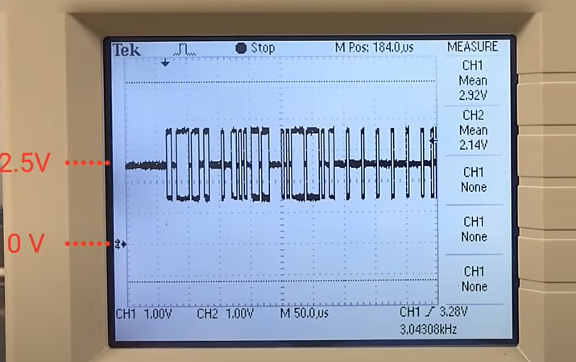
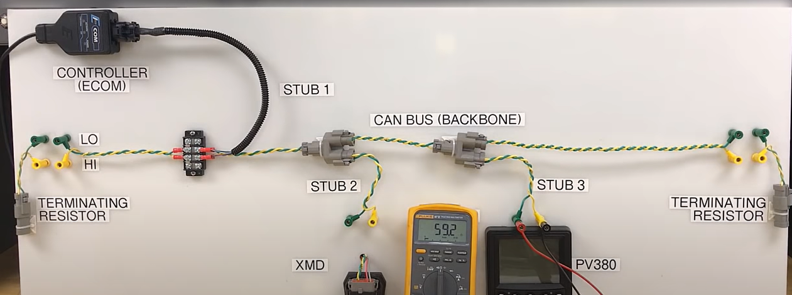

# CAN or not?

CANopen

The object dictionary is the method by which a CANopen device can be communicated with. For example, one could write a true to the index in the manufacturer-specific section of the object dictionary (2000h-5FFFh), which the device could interpret as an enable signal for acquiring data from a voltage input. Conversely, the master may also want to read information from the object dictionary to get the acquired data, or to find out how to device is currently configured. The two communication mechanisms for accessing the object dictionary are Service Data Objects (SDOs) and Process Data Objects (PDOs)

A "node" refers to a master or slave.

On CANopen network, number of devices is limited to 127 nodes. This is because of the 7-bit size limitation.

<cr https://files.danfoss.com/download/Drives/MG07E102.pdf >

In a particular CANopen protocol, the communication is done via service data objects (**SDOs**), process data objects (**PDOs**), and network management (**NMT**). 

PDOs are real-time process data with high priority. PDOs are only available if the node is in operational state. SDOs are non-time-critical data and are used to configure the frequency converter. 

SDOs are only available if the node is in both operational and pre-operational state. 

NMT functions monitor the network stability and include synchronization, detection of faults, and emergency message transmission.

SDO : Service Data Object

SDO is a function to directly access an object entry in the object dictionary of any CANopen node

PDO : Process Data Object

The CANopen application layer provides several protocols. The only mono-master protocol is the network management (NMT) protocol. 

NMT:
Network Management (NMT) is a function to manage the CANopen network status. Master controls all slaves. Master dies, slave dies.

NMT State:
NMT state is the operating status of a CANopen node. When the NMT state is Operational, the CANopen node is capable of all communications

there are 4 node states for RJ71CN91 : 
init, pre-op, op, stop

flying/sleeping master

There is usually just one NMT master device that sends the NMT message to control the other CANopen devices. To avoid a single point of failure, CANopen provides an optional NMT "Flying" master functionality. This means that there are additional CANopen devices in the network that provide NMT master functionality, but this function is not yet activated. If the active NMT master device loses connection to the network, the remaining devices with "sleeping" NMT master functions start to negotiate as to which one will act as the NMT master. Each NMT master capable device has a unique priority, assigned by the system designer. If a temporarily disconnected NMT master-capable device is connected it again, it requests the priority of the active NMT master and possibly starts the above-mentioned negotiation process. 

### Troubleshooting CAN Bus and properties

<cr Troubleshooting CAN Bus & Properties https://www.youtube.com/watch?v=ulcKnrPmJqM >

CAN LOW = 2.5 - 1.5V dc

CAN HI = 2.5 - 3.5V dc

when broadcasting data 

  

will typically sit at 2.5v, depends on bus loading. not sending alot of data on bus so not alot of diff btw can high and can low

reflections in can signal when its not terminated causes you to be able to diagnose which part is the failure point. For best effects in these reflections, keep the stubs as short as possible.

  

when both resistors are connected : measure resistance across can high and can low from a stub. resistance across the stubs should be the parallel resistance across the number of resistors which is 60ohms in this example. But when one resistor is disconnected, the resistance across both the stubs will increase to 120ohms (in this eg). If you have 3, then its 40ohms if all are connected.

if can high is lower than can low ; this means that someone has connected can low to can high somewhere on the backbone  

resources:

https://www.ni.com/en-sg/innovations/white-papers/13/the-basics-of-canopen.html

https://www.controleng.com/articles/canopen-provides-distributed-control-functionality/#:~:text=To%20avoid%20a%20single%20point,function%20is%20not%20yet%20activated.

https://files.danfoss.com/download/Drives/MG07E102.pdf (the PDF explains CAN communication protocol, good read)