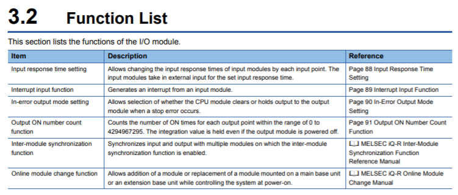
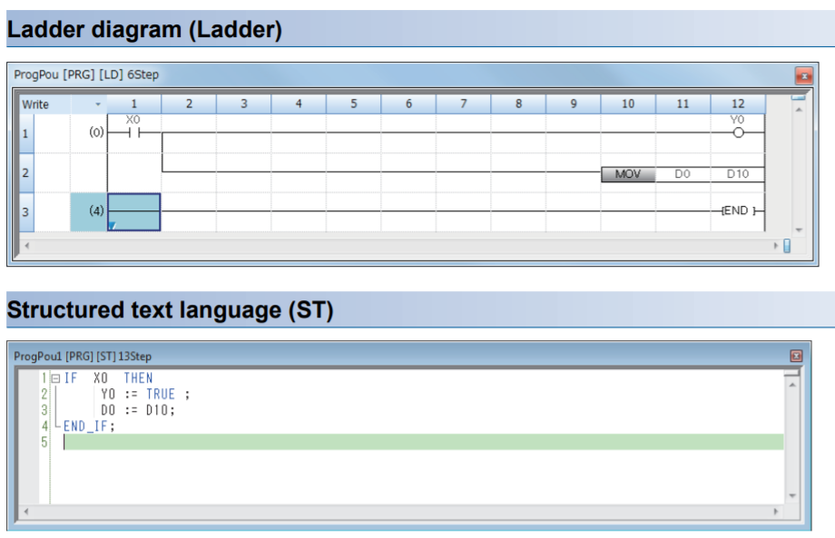
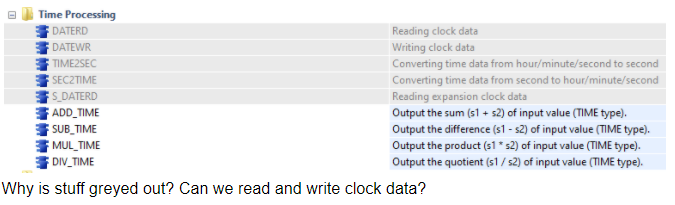

# MITSUBISHI IQ-R SERIES

  

Parameter Settings

Setting parameters here eliminates the need to program them.

7.1 Parameter Setting Procedure 

1. Add the I/O module to the setting in the engineering tool. [Navigation window] > [Parameter] > [Module Information] > Right-click > [Add New Module] 
2. The parameter setting consists of four items: the input response time setting, interrupt setting, setting of error-time output mode, and refresh setting. Select these items from the tree window below to set them. [Navigation window] > [Parameter] > [Module Information] > Module model name > [Module Parameter] 
3. Write the setting into the CPU module using the engineering tool. [Online] > [Write to PLC] 
4. Reset the CPU module or turn off and on the power to reflect the setting

parameters : 

input response time (x00 to x3f)
each input has a response time

interrupt input function(condition : leading edge/falling edge?)

error time output mode (y0 to y3f)

refresh setting (this should be lag time)

shortcuts

`shift + ins` add new row above

`/` switch NO / NC

`F3` enter/exit system monitor mode

`F4` Compile

`F5, F6, F7` NO input, NC input, output

`ctrl + arrow keys` draw lines

b : boolean

i : integer

u : unsigned integer (positive integer)

POU

MOV : transfers 16 bit data

DMOV : transfers 32 bit data

EDMOV : transfers double precision real number

EMOV : transfers single precision real number

MOVB : transfers binary data (move binary)

BLKMOVB : transfers 1 bit data

`OUT` The OUT instruction turns on a specified device when the input condition turns on, and turns off the device when the condition turns off.

`SET`The SET instruction turns on a specified device when the input condition turns on, and holds the on state of the device even though the condition turns off. To turn off the device, use the RST instruction

The following table lists the instructions not described in this chapter. These instructions are introduced in `"Introduction: PLC Course"` and supported by conventional MELSEC-A series.

  

A "relay", which is also called an electromagnetic relay, is a switch that relays signals. A relay is a key component that makes up a logic circuit. 

1) Passing a current through a coil > Energization 

• A normally open contact is closed (continuity state). 

• A normally closed contact is open (non-continuity state). 

2) Stopping a current flowing through a coil > Deenergization 

• A normally open contact is open (non-continuity state). 

• A normally closed contact is closed (continuity state).

qns before first training

coil, contacts, relays

COILS AND CONTACTS
When an output device is an input, it turns into a coil

Bit devices that are not outputs but are inputs are contacts (push buttons)

`/` key changes between nc and no
`alt / ` changes between rising contact and falling contact

routines and subroutines

how many bits do ols and lidar and actuator store (how to invoke data table)

what is annunciator

> calls errors. usually a dedicated light on the PLC.

how to input OLS signal

what is sLCP

execution type

why the output does not energise input in the program

whats SM606

> system memory no. 606. has its own function

is there an input / outputs list and functions (hexadecimal vs user inputted functions). is device = input/ output?

> device list : `ctrl + D`

what does converting a program mean? maybe compiling?

> yes

diff btw module parameter and cpu parameter

what is a device, how to interpret device numbers. where is the list of devices

> `ctrl+D`

explain PID unknowns

what is CC-link

> comms protocol

How do function blocks work (tabs reference in prog)

`PAGE` operation

`CALL` operation

is `SET` instruction an inbuilt latching program tool?

does each line in the ladder run async from left to right

> no. still line by line

how to find out the data register references

counters (c20, c30? what are all the C's)

Analog sensors to interface with plc

Does the wheel only move at one speed (ie, only stop and fixed forward/backwards speed)? If so, can pid meh?

Why is there an error in the CANopen bar? What is CANopen in general and how is it used for this application?

> only ols

How to tell which assigned code corresponds to which wire (without electric diagram)

Why got different tabs in the program

Explain d2a, motor driver, connections.

Explain PID instructions

Why do some data registers in our program start below D100

  

