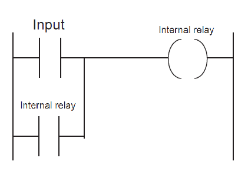
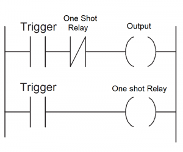

# PLC Programming

Housekeeping

To make a very long story short, PLC is just arduino but for industrial automation.

PLC consists of 

1)CPU (microprocessor, memory chip(to store prog), integrated circuits (modbus, lan))

2)Input Pin controller

3)Output Pin controller

4)PSU

cr https://basicplc.com/plc-programming/

#### **Latching Programs**

  

Latch allows output to be held ON for indefinite amount of time. This is because the output is parallel to the input condition

#### **One-Shot Operation**

  

One shot basically means that the trigger will supply power to the output upon trigger press only. Then the NOT relay will cut power to it instantly.