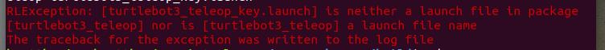

# ROS Cheatsheet

This is a cheat sheet prepared and used by myself.


[TOC]

# Introduction

When I mention a term you do not understand, you can check it out (ctrl f-able) on 
`http://wiki.ros.org/ROS/Concepts`


Introduction in progress...

## ROSTOPIC
A tool for displaying debug information about ROS topics, including publishers, subscribers, publishing rate, and messages.

Commands:
rostopic **Method** to do **Description**
```
Method          Description
__________________________________
bw
echo
hz
list
pub
type
find            find topics by type
```


------

------


## Turtlesim (for testing)

Linux really likes turtles, huh


starts roscore 
`roscore`  


run turtlesim
`rosrun turtlesim turtlesim_node`  


using arrow keys to move turtle
`rosrun turtlesim turtle_teleop_key`  


------

------


## Catkin


**Introduction to Catkin**

Catkin is a build system superseding the original rosbuild system. At the time of writing this, rosbuild is outdated and you should probably just learn Catkin unless your project includes some really old repo.


**Making a workspace**

```
mkdir -p catkin_ws/src # Create a catkin_ws folder with a src folder in it

cd catkin_ws # Navigate into the folder's root

catkin_make # Build the required files
```


Initialize a workspace with a default layout (``src``/``build``/``devel``) in the *current* directory:

  - ``catkin init``
  - ``catkin init --workspace .``
  - ``catkin config --init``
  - ``mkdir src && catkin build``


 When you set up your catkin workspace, you usually get 3 files : 
`build`, `devel`, and `src`.


The basic idea is that you put packages that you want to install on your ROS system into your `src` file. (that's why you have seperate workspaces for seperate projects) 


Then, you run the command `catkin_make` or `catkin build` on your workspace file level. This is the file that contains your `build`, `devel`, and `src` files.


`catkin_make` or `catkin build` will then proceed to install all your packages onto your ROS system.

So, `catkin_make` and `catkin build` both do the same things pretty much. `catkin_make` is a bit old and `catkin build` is a framework on top of it, written in python. We use catkin build mostly in this day and age.


**Sourcing your workspace**

Always source your workspace to allow you to run commands from the workspace in your terminal.

`source devel/setup.bash` from your workspace's root.


Alternatively, append the source command to your `~/.bashrc` so you do not have to keep writing this command:

`Append source <workspace_directory>/devel/setup.bash` to append


If you have sourced properly, run `echo $ROS_PACKAGE_PATH` and ensure your workspace directory appears here


------

------


## Bashrc

**Introduction to Bashrc**

The `~/.bashrc` is kind of like a configuration file that runs whenever each terminal is open.  

To open your bashrc file, you use the command : `gedit ~/.bashrc`. I've set mine to an alias `bashrc` (covered later on), so I dont have to type this cancerous command which makes my fingers hurt every time.


Sometimes, the bashrc may not update when you add stuff to it. In that case, just "refresh" it!  

We "refresh" by using the source command : `source ~/.bashrc`  


You may add `alias` to the bashrc so that you can "configure" your own commands. 


### Alias

`alias <aliasname>='<commands>'`

there can not be any whitespace btw `<aliasname>`,`=`, and `<commands>`

You append this command into the bashrc. It runs whenever you open a new terminal. Hence, whatever pseudo code you manage to come up with will be code for the system. Take a look at my personal list of aliases to get a general idea of its usefulness.


**My personal list of Aliases to copypaste across computers**

```
# my own aliases
alias bashrc='gedit ~/.bashrc'
alias srcbashrc='source ~/.bashrc'
```


------

------


## rosbag

**Introduction to rosbag**

rosbag is a set of tools to save and record data, then used to play back data of ROS topics, mainly used for simulations.

`pip install pyrosbag` to install.


(this section on rosbag was from methyldragon's github :[https://github.com/methylDragon/ros-sensor-fusion-tutorial/blob/master/01%20-%20ROS%20and%20Sensor%20Fusion%20Tutorial.md](https://github.com/methylDragon/ros-sensor-fusion-tutorial/blob/master/01 - ROS and Sensor Fusion Tutorial.md))

(I dont see why I should reinvent the wheel if its already written so nicely)


Read more: http://wiki.ros.org/rosbag/Tutorials

Commandline reference: http://wiki.ros.org/rosbag/Commandline


rosbag lets you record data and messages from an actual robot, so you can play them back. This is **insanely** useful because it's pretty much the only way you can get consistent real world data repeated for testing with sensor fusion to see if your sensor fusion settings made a (hopefully positive) difference.

Be sure to wait for rosbag to subscribe to everything first! And remember that rosbag will write the file where the command was run!

The only commands you really need are

```
$ rosbag record
$ rosbag play
$ rosbag filter
```

There are a lot of flags, you can refer to the command line reference for that, but the ones you generally will be using are:

**Record**

```
# To record several specific topics
$ rosbag record <topic names>

# To record everything
$ rosbag record -a

# To have specified bag file names
$ rosbag record -O <output file name>
```

**Play**

```
# Play a rosbag (ensure roscore is active!)
$ rosbag play <bag_file_dir>

# Note: It's good practice to also run these before running a rosbag, so you can
# Simulate time!
$ rosparam set use sim_time true
$ rosbag play --clock <bag_file_dir> # This publishes the clock time
```

**Filter**

```
# Make a new rosbag, filtering out messages that don't match the Python expression
$ rosbag filter <bag_file> <output_bag_file> "<some python expression>"

# For example...
$ rosbag filter my.bag only_tf.bag "topic == '/tf'"
$ rosbag filter my.bag only_tf_and_scan.bag "topic == '/tf' and topic == '/scan'"

# It can take the following
# topic: The msg topic
# m: The msg itself
# t: The time of the msg
```

If you're in doubt, just use the -h or --help flag for usage!

You can also use `$ rosrun rqt_bag rqt_bag` for a [GUI interface](http://wiki.ros.org/rqt_bag)!


------

------


## Check which version of ROS you have installed

`rosversion -d`


## Common problems


**Unable to lock the administration directory (/var/lib/dpkg/)**

This happens when ubuntu is updating. It may get stuck updating. So just find out what the running process is and kill it.


To find out what the running process is :

`ps aux | grep -i apt`


To kill the process :

`sudo kill <process_id>`

`sudo kill -9 <process_id>`


-9 is to force kill it. or you can do killall :

`sudo killall apt apt-get`


**<> is neither a launch file in package nor is it a launch file name**

  

This happens when you do not source your environment.


When you build something, the products of the build system are stored somewhere. If you source that environment (e.g. ~/catkin_ws) you have access to the build products (e.g. roslaunch my_package my_launch)


solution :

source `<path_to_your_workspace>/devel/setup.sh` to your `~/.bashrc`


Other person Cheat Sheet
===========

This is a non-exhaustive list of some common and useful invocations of the ``catkin`` command.
All of the commands which do not explicitly specify a workspace path (with ``--workspace``) are assumed to be run from within a directory contained by the target workspace.

CR @ https://github.com/catkin/catkin_tools/blob/master/docs/cheat_sheet.rst

**Initializing Workspaces**

Initialize a workspace with a default layout (``src``/``build``/``devel``) in the *current* directory:
  - ``catkin init``
  - ``catkin init --workspace .``
  - ``catkin config --init``
  - ``mkdir src && catkin build``

... with a default layout in a *different* directory:
  - ``catkin init --workspace /tmp/path/to/my_catkin_ws``

... which explicitly extends another workspace:
  - ``catkin config --init --extend /opt/ros/indigo``

Initialize a workspace with a **source space** called ``other_src``:
  - ``catkin config --init --source-space other_src``

... or a workspace with **build**, **devel**, and **install space** ending with the suffix ``_alternate``:
  - ``catkin config --init --space-suffix _alternate``

**Configuring Workspaces**

View the current configuration:
  - ``catkin config``

Setting and unsetting CMake options:
  - ``catkin config --cmake-args -DENABLE_CORBA=ON -DCORBA_IMPLEMENTATION=OMNIORB``
  - ``catkin config --no-cmake-args``

Toggle installing to the specified **install space**:
  - ``catkin config --install``

**Building Packages**

Build all the packages:
  - ``catkin build``

... one at a time, with additional debug output:
  - ``catkin build -p 1``

... and force CMake to re-configure for each one:
  - ``catkin build --force-cmake``

Build a specific package and its dependencies:
  - ``catkin build my_package``

... or ignore its dependencies:
  - ``catkin build my_package --no-deps``

Build the package containing the current working directory:
  - ``catkin build --this``

... but don't rebuild its dependencies:
  - ``catkin build --this --no-deps``

Build packages with additional CMake args:
  - ``catkin build --cmake-args -DCMAKE_BUILD_TYPE=Debug``

... and save them to be used for the next build:
  - ``catkin build --save-config --cmake-args -DCMAKE_BUILD_TYPE=Debug``

Build all packages in a given directory:
  - ``catkin build $(catkin list -u -d /path/to/folder)``

... or in the current folder:
  - ``catkin build $(catkin list -u -d .)``


Cleaning Build Products


Blow away the build, devel, and install spaces (if they exist):
  - ``catkin clean``

... or just the **build space**:
  - ``catkin clean --build``

... or just clean a single package:
  - ``catkin clean PKGNAME``

... or just delete the build directories for packages which have been disabled or removed:
  - ``catkin clean --orphans``

Controlling Color Display


Disable colors when building in a shell that doesn't support it (like IDEs):
  - ``catkin --no-color build``

... or enable it for shells that don't know they support it:
  - ``catkin --force-color build``

Profile Cookbook


Create "Debug" and "Release" profiles and then build them in independent build and devel spaces:
  .. code-block:: bash

    catkin config --profile debug -x _debug --cmake-args -DCMAKE_BUILD_TYPE=Debug
    catkin config --profile release -x _release --cmake-args -DCMAKE_BUILD_TYPE=Release
    catkin build --profile debug
    catkin build --profile release

Quickly build a package from scratch to make sure all of its dependencies are satisfied, then clean it:
  .. code-block:: bash

    catkin config --profile my_pkg -x _my_pkg_test
    catkin build --profile my_pkg my_pkg
    catkin clean --profile my_pkg --all

**Manipulating Workspace Chaining**

Change from implicit to explicit chaining:
  .. code-block:: bash

    catkin clean
    catkin config --extend /opt/ros/indigo

Change from explicit to implicit chaining:
  .. code-block:: bash

    catkin clean
    catkin config --no-extend

**Building With Other Job Servers**

Build with ``distcc``:
  .. code-block:: bash

     CC="distcc gcc" CXX="distcc g++" catkin build -p$(distcc -j) -j$(distcc -j) --no-jobserver

**Changing Package's Build Type**

Set the build type to ``cmake`` in the ``package.xml`` file's ``<export/>`` section:
  .. code-block:: xml
    

    <export>
      <build_type>cmake</build_type>
    </export>


# Misc

todo : stuff to write script to install package for new computers


**python module not found even though it was installed :**

The reason this error occurs is because Python packages in /opt are added to PYTHONPATH environment variable BUT for ones in /usr, path does not exist in PYTHONPATH variable. The python-rospkg gets installed in /usr by default. So you just need following line in .bashrc to fix this:

```
export PYTHONPATH=$PYTHONPATH:/usr/lib/python2.7/dist-packages
```


