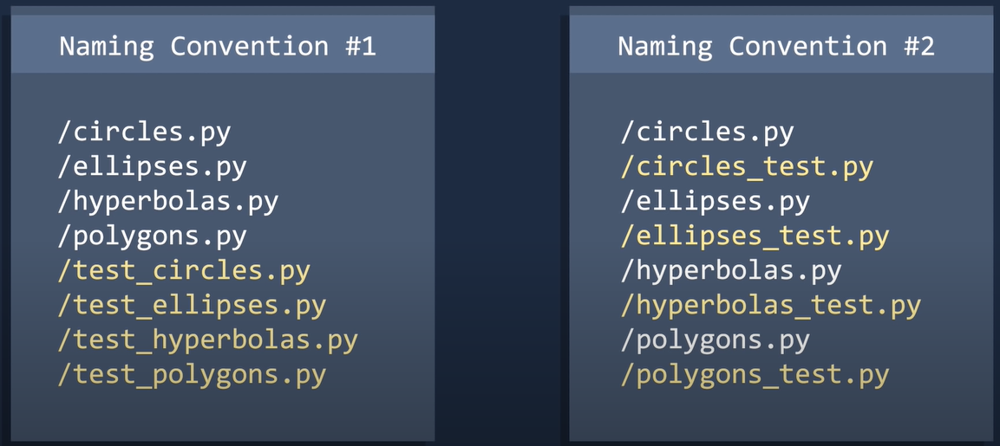

### Unit Testing


normally seperate files from the original test code


2 conventions of naming 




the first one lumps all your normal code and tests seperately, the second one lumps your normal code and tests together. depends on how u like em


```
class Test_Thing(unittest.TestCase):
	def test_thing(self):
	
	# Test thing
	
	self.assertAlmostEqual(<function_you_wanna_test_and_input>, <expected_answer>)
```


useful references 

https://www.youtube.com/watch?v=1Lfv5tUGsn8 [socratica]